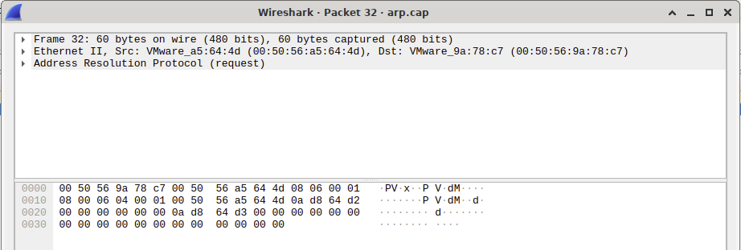

# IPK Project 2 - ZETA: Network sniffer
Author: Šimon Benčík, xbenci01

## Introduction
The goal of the project was to create a Network Sniffer using a *pcap library. The sniffer should allow various arguments that help specify protocol to capture, port and number of packets.

## Theory
A network sniffer is a tool used to monitor and analyze network traffic. It captures packets that flow across a network on set interface and analyzes their content. Sniffers are used for various applications, including diagnosing network issues, preventing security threats or optimizing network performance.

## Design
The sniffer is written in C# using framework .NET 6.0. To parse arguments, a library **CommandLineParser** was used, which handles many edgecases and helps keeping the code for parsing arguments clean and short. In order to work with interfaces and capture data a **SharpPcap** library was used. This library is built on top of libpcap and WinPcap and provides simple API for .NET framework. Besides that, a library **PacketDotNet** was used to dissect incoming packets.

## Implementation
At the beginning, arguments are parsed based on the Options class by CommandLineParser. If not interface is provided, the program shows list of all active interfaces and exits, otherwise it checks if the provided interface is contained in CaptureDeviceList class provided by SharpPcap. Additionally, a port is checked for correct format and range. When device is assigned to variable, it's type is changed, in order to control amount of packets to capture, since instance of CaptureDeviceList doesn't provide argument for Capture method. Afterwards, a handler, represented by helper function is assigned to device.onPacketArrival. In this method, needed packet data is extracted and printed. For printing byte offset, a helper function was created that iterates over the packet data and prints out hex byte offset as well as it's ASCII representation. This byte offset output matches the one presented in tool Wireshark. For filters, a dictionary is created in order to loop over it's bool values. When value is true, the key is added to filters array, with the exception of mld and ndp protocols that require icmp6 type set. After the loop is over, the filters array containing strings is joined with keyword "or". This allows for combining multiple protocols when we want to capture for example both arp and icmp6 packets.

## Testing
Testing was done manually throughout the entire development process. Vast majority of testing was aimed at the output format of the packets (correct addresses, byte offset representation), functionality of filters and incorrect inputs in order to avoid unhandled exceptions. The process consisted of following: 
1. At first a packet captures for various protocols were ran using **tcpreplay** on loopback interface (since it gets less traffic). To test the different protocols, the captures were downloaded from [PacketLife](https://packetlife.net/captures/).
2. Having open both Wireshark and network sniffer, output was compared between the two.
3. Some protocols, namely ndp and mld were harder to test this way (missing captures on PacketLife for mld), so a small python script using library scapy was used to mock and send out these packets.

The testing environment was macOS 13.2.1 as well as the reference virtual machine running nixOS. Some sample outputs compared to wireshark can be seen in following images:

<table>
  <tr>
    <th> Sniffer </th>
    <th> Wireshark </th>
  </tr>
  <tr>
    <td>
        
<b>TCP</b>

        
    </td>
    <td>
        
    </td>
  </tr>
  <tr>
    <td>
        
<b>UDP</b>

        
    </td>
    <td>
        
    </td>
  </tr>
  <tr>
    <td>
        
<b>ARP</b>

        
    </td>
    <td>
        
    </td>
  </tr>
  <tr>
    <td>
        
<b>ICMPv6</b>

        
    </td>
    <td>
        
    </td>
  </tr>
</table>

## Sources
- C# reference - https://learn.microsoft.com/en-us/dotnet/csharp/language-reference/
- CommandLineParser - https://github.com/commandlineparser/commandline
- sharppcap - https://github.com/dotpcap/sharppcap
- pcap-filter man page https://www.tcpdump.org/manpages/pcap-filter.7.html
- packetlife - https://packetlife.net/captures/
- tcpreplay man page https://linux.die.net/man/1/tcpreplay